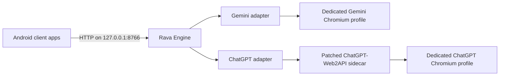

# Rava Engine

Rava is a local, headless gateway that gives Android applications one API for
logged-in ChatGPT and Gemini web sessions. Client applications choose a model,
send messages, continue conversations, and receive normal or SSE responses
without embedding provider-specific browser automation.

Rava currently runs inside Termux. The included **Rava Setup** Android app
guides users through installation, account sign-in, session capture, startup,
and health checks.

> [!IMPORTANT]
> Rava uses unofficial web integrations rather than the official OpenAI or
> Google APIs. Website changes can break an adapter without notice. Keep the
> dedicated browser sessions open while the engine is running, and use this
> project only with accounts and devices you control.

## Current status

- Shared local HTTP API for ChatGPT and Gemini
- Dynamic model discovery with namespaced IDs
- Fail-closed model selection: an unavailable model returns an error
- Isolated conversations per client application, provider, and model
- Normal JSON responses and Server-Sent Events
- Conversation continuation and cancellation
- Separate Chromium profiles for ChatGPT and Gemini
- Graphical Android setup companion
- Built-in Android test chat with model selection and conversation continuation
- Automatic routing of ChatGPT conversations into a dedicated `Rava` project
- Temporary Gemini conversations so Rava does not add entries to Gemini history
- Tested on a physical ARM64 phone running Android 14 and Termux 0.119

The physical-device test suite has verified model discovery, invalid-model
rejection, normal completion, conversation continuation, and streaming for both
providers. The exact models available depend on the signed-in accounts.

Rava looks up or creates a project named `Rava` in ChatGPT and sends new
ChatGPT conversations into it. Gemini currently has no equivalent project
folders, so Rava uses Gemini's temporary-chat mode to keep those conversations
out of Gemini history. Set `RAVA_CHATGPT_PROJECT` to an empty value to disable
ChatGPT project routing, or `RAVA_GEMINI_TEMPORARY=false` to retain Gemini chats.

## Architecture



Rava keeps its HTTP contract separate from provider adapters. This allows a
future Android Bound Service/AIDL transport to reuse the same engine behavior.

## Requirements

For Android/Termux operation:

- Android 8.0 or newer
- A current [Termux release](https://github.com/termux/termux-app/releases)
- [Termux:X11](https://github.com/termux/termux-x11/releases)
- Internet access for dependency installation and provider websites
- ChatGPT and Gemini accounts that can sign in through the browser profiles

Do not use the obsolete Google Play build of Termux.

For local development:

- Python 3.11 or newer
- Java 17 and Android SDK 35 or newer to build the setup application

## Rava Setup Android app

The graphical setup app performs these steps:

1. Copies the one-time Termux external-command setting.
2. Requests `com.termux.permission.RUN_COMMAND`.
3. Verifies command execution and result delivery.
4. Transfers the Rava source bundle embedded in the APK and installs dependencies.
5. Opens the dedicated ChatGPT sign-in profile.
6. Opens the dedicated Gemini sign-in profile.
7. Captures the Gemini session securely.
8. Starts Chromium, the ChatGPT sidecar, and Rava Engine.
9. Displays provider health and discovered models.

After startup, choose **Chat** in the bottom navigation, reload the model list, select a
model, and send a message. The test client continues the same conversation
until **New chat** is tapped.

Build the app from source:

```bash
cd android-installer
./prepare-bundle.sh
./gradlew :app:assembleDebug
```

The APK is written to:

```text
android-installer/app/build/outputs/apk/debug/app-debug.apk
```

The first step still requires one paste inside Termux. Termux intentionally
disables commands from external applications until
`allow-external-apps=true` is set by the user. See the
[Termux RUN_COMMAND documentation](https://github.com/termux/termux-app/wiki/RUN_COMMAND-Intent).

## Manual Termux installation

Clone Rava into the Termux home directory and run the full installer:

```bash
pkg install -y git
git clone https://github.com/espitman/Rava.git ~/Rava
bash ~/Rava/scripts/device-full-install.sh
```

The installer adds Python and build tools, Termux:X11 packages, Chromium, Rava,
and the pinned and patched ChatGPT-Web2API sidecar.

Open the ChatGPT profile and sign in:

```bash
bash ~/Rava/scripts/start-termux-browser.sh https://chatgpt.com/
```

Open the separate Gemini profile and sign in:

```bash
bash ~/Rava/scripts/start-gemini-login-browser.sh
```

After Gemini sign-in, capture the session:

```bash
~/Rava/.venv/bin/python ~/Rava/scripts/capture-gemini-session.py
```

Start the complete stack on later runs:

```bash
bash ~/Rava/scripts/start-rava-stack.sh
```

The command enables a Termux wake lock, starts both Chromium profiles and the
ChatGPT sidecar, refreshes the Gemini session, and launches Rava at
`http://127.0.0.1:8766`.

## HTTP API

Every conversation request must identify the calling application using either
the `X-Rava-App-Id` header or an `app_id` field in the JSON body.

### Health and models

```bash
curl http://127.0.0.1:8766/health
curl http://127.0.0.1:8766/v1/models
```

Model IDs are namespaced:

```text
chatgpt/<upstream-model>
gemini/<upstream-model>
```

### Normal completion

```bash
curl http://127.0.0.1:8766/v1/chat/completions \
  -H 'Content-Type: application/json' \
  -H 'X-Rava-App-Id: com.example.notes' \
  -d '{
    "model": "gemini/gemini-flash",
    "messages": [{"role": "user", "content": "Summarize this idea."}],
    "stream": false
  }'
```

The response includes a `conversation_id`. Send it in a later request to
continue the same provider conversation. A conversation cannot be accessed by
a different `app_id` or switched to another provider or model.

### Streaming completion

```bash
curl -N http://127.0.0.1:8766/v1/chat/completions \
  -H 'Content-Type: application/json' \
  -H 'X-Rava-App-Id: com.example.notes' \
  -d '{
    "model": "chatgpt/gpt-5-5",
    "messages": [{"role": "user", "content": "Write one sentence."}],
    "stream": true
  }'
```

### Endpoints

| Method | Path | Purpose |
| --- | --- | --- |
| `GET` | `/health` | Report provider availability |
| `GET` | `/v1/models` | Discover namespaced account models |
| `POST` | `/v1/conversations` | Create a conversation explicitly |
| `DELETE` | `/v1/conversations/{id}` | Delete a conversation |
| `POST` | `/v1/chat/completions` | Generate a normal or SSE response |
| `POST` | `/v1/requests/{id}/cancel` | Cancel an active request |

## Configuration

Rava reads environment variables first, followed by
`~/.config/rava/config.json`.

| Environment variable | Default | Description |
| --- | --- | --- |
| `RAVA_HOST` | `127.0.0.1` | HTTP bind address |
| `RAVA_PORT` | `8766` | HTTP port |
| `CHATGPT_WEB2API_URL` | `http://127.0.0.1:8080` | ChatGPT sidecar URL |
| `CHATGPT_WEB2API_KEY` | empty | Optional sidecar bearer key |
| `GEMINI_SECURE_1PSID` | empty | Gemini web-session cookie |
| `GEMINI_SECURE_1PSIDTS` | empty | Optional Gemini session cookie |

The capture helper writes Gemini session values to the private Termux sandbox
with file mode `0600`. Cookies and local runtime files are excluded from Git.

## Security model

Rava binds to loopback by default. Do not expose it on a LAN or public network
without adding authentication. `app_id` isolates conversation state but is not
an authentication credential.

The setup app can execute commands inside Termux only after the user enables
external applications and grants Android's Termux command permission. Revoke
that permission after setup if the companion app is no longer needed.

Never commit browser profiles, cookie files, `~/.config/rava/config.json`, or
runtime logs.

## Development

Create a local environment:

```bash
python3.11 -m venv .venv
.venv/bin/pip install -e '.[dev]'
```

Run validation:

```bash
.venv/bin/pytest -q
.venv/bin/ruff check .
```

Physical-device helpers are documented in
[`docs/ANDROID_REAL_DEVICE.md`](docs/ANDROID_REAL_DEVICE.md).

## Upstream integrations

- [HanaokaYuzu/Gemini-API](https://github.com/HanaokaYuzu/Gemini-API), pinned in `pyproject.toml`
- [Octo-Lex/ChatGPT-Web2API](https://github.com/Octo-Lex/ChatGPT-Web2API), pinned by the installer and modified with `patches/chatgpt-web2api-strict-model.patch`

The ChatGPT patch rejects failed model discovery and selection instead of
silently falling back, preserves conversation IDs, and provides progressive
SSE behavior through the Rava adapter.

## Known limitations

- The provider integrations depend on web behavior and may require maintenance.
- Both dedicated Chromium profiles must remain running.
- Android may stop Termux or Chromium under battery and memory pressure.
- Each device must sign in to its own provider accounts once.
- The current release is a Termux-based prototype; a self-contained engine APK
  remains a future phase.

Rava is an independent project and is not affiliated with or endorsed by
OpenAI, Google, Termux, or the upstream connector projects.
